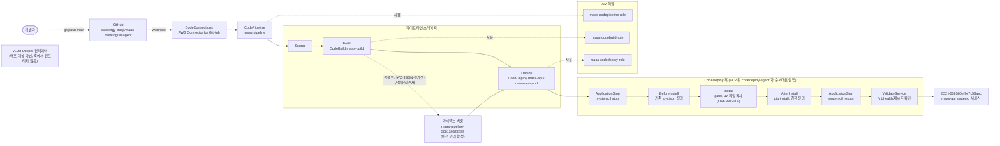

# CI/CD 파이프라인 구성도

`main` 브랜치 푸시로 시작해 EC2 배포까지 이어지는 전체 흐름. GitHub Actions
워크플로(`.github/workflows/*.yml.disabled`)는 비활성화돼 있고, 이
CodePipeline 이 유일한 배포 경로다.

## 요약

- **Build 단계는 배포하지 않는다.** 문법 검사, `gate/*.json` 파싱, 평가셋
  검증, 배포 구성 파일 존재 확인만 하고 아티팩트를 그대로 넘긴다 — GPU도
  vLLM도 없는 환경이라 실제 API 호출·모델 추론은 하지 않는다.
- **systemd 유닛 파일(`/etc/systemd/system/maas-api.service`)은 어느 훅도
  덮어쓰지 않는다** — API 키가 `Environment=` 로 들어 있어서다. 훅은
  `/opt/maas/gate`, `/opt/maas/ui` 아래 소스만 교체한다.
- **vLLM 컨테이너는 이 파이프라인과 완전히 무관하다.** 훅 스크립트 어디에도
  `docker` 명령이 없다.
- EC2 인스턴스가 꺼져 있으면 CodeDeploy가 배포그룹의 대상(태그
  `CodeDeployTarget=maas-api`)을 찾지 못해 **배포가 실패한다** (자동으로
  건너뛰지 않는다 — GitHub Actions 버전과의 차이).

세부 구성요소·리소스 ID는 [README.md](README.md) 표를, 운영 절차는
[operations.md](operations.md)를 참고.
