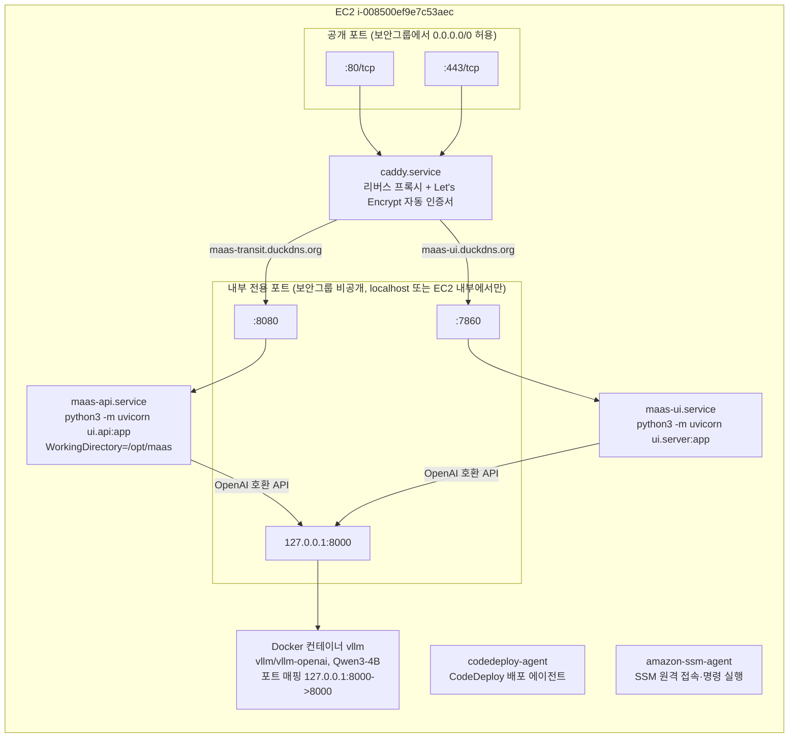

# EC2 내부 구성

인스턴스 `i-008500ef9e7c53aec` (g6e.xlarge, NVIDIA L40S 46GB, Ubuntu 22.04
Deep Learning AMI) 안에서 도는 프로세스와 포트.



## `/opt/maas` 디렉터리 구조

CodeDeploy가 `appspec.yml`의 `files:` 매핑으로 배포하는 대상. systemd 유닛
파일은 이 밖(`/etc/systemd/system/`)에 있어 배포 대상이 아니다.

```
/opt/maas/
├── requirements.txt        # AfterInstall 훅에서 pip install 대상
├── gate/
│   ├── *.py                 # pipeline.py, tools.py, api.py, geocode.py 등
│   ├── *.json                # transit_nodes.json, admin_areas.json 등 (좌표/코드 캐시)
│   └── *.xlsx                 # seoul_121_areas.xlsx (원본 데이터)
└── ui/
    ├── *.py                 # api.py(:8080), server.py(:7860), eval_endpoint.py
    └── *.html                 # index.html
```

## 요약

- `MaasApi`/`MaasUi` → vLLM 화살표는 in-process 함수 호출이 아니라 실제
  HTTP(OpenAI 호환 API) 호출이다 — `VLLM_URL` 환경변수로 가리킨다.
- vLLM은 Docker 포트 매핑 자체가 `127.0.0.1:8000`이라 EC2 밖에서는 물론
  같은 서버의 다른 컨테이너에서도(host 네트워크가 아니라면) 접근할 수 없다.
- `codedeploy-agent`, `amazon-ssm-agent`는 애플리케이션 프로세스가 아니라
  배포/운영을 위한 인프라 에이전트다 — 별도 포트를 열지 않는다.

관리 명령은 [operations.md](operations.md)를 참고.
