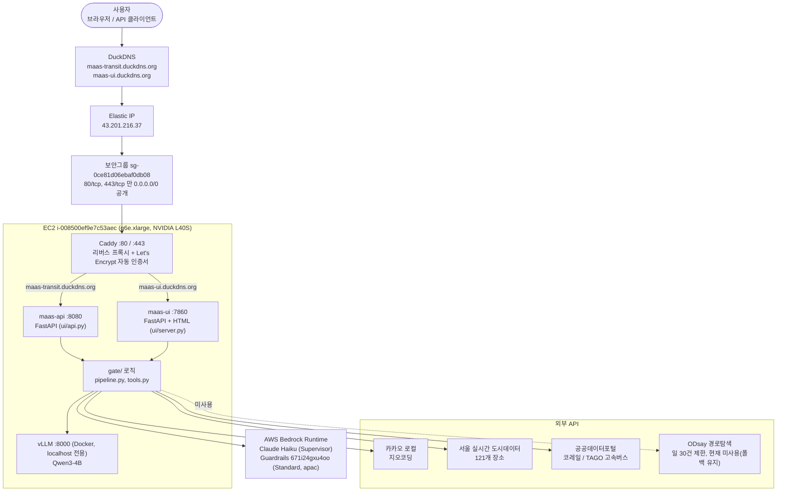

# 전체 인프라 구성도

2026-08-31 기준, 실제 운영 중인 구성이다. AWS 계정 508139322599(kosa-edu-3,
2026-09-08 만료), 리전 ap-northeast-2(서울).

## 요약

- 외부에 노출되는 건 Caddy(80/443)뿐이다. `maas-api`(8080)와 `maas-ui`(7860)는
  보안그룹에서 막혀 있고 Caddy를 통해서만 도달한다.
- `maas-api`와 `maas-ui`는 별개 프로세스지만 같은 `gate/` 파이썬 모듈
  (`pipeline.py`, `tools.py`)을 각자 임포트해서 쓴다 — 서로 네트워크로
  호출하지 않는다.
- vLLM은 Docker 컨테이너로 `127.0.0.1:8000`에만 바인딩돼 있어 EC2 내부에서만
  접근 가능하다.
- ODsay는 일일 호출 한도(30건)가 낮아 실사용에서는 꺼져 있고, 실패 시
  폴백(안내 문구)으로 항상 동작하는 상태를 유지한다.

세부 구성요소·리소스 ID는 [README.md](README.md) 표를 참고.
