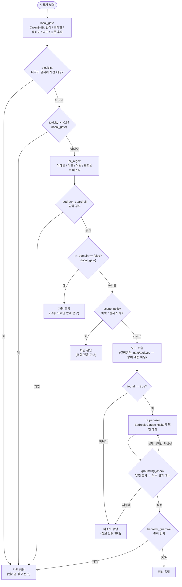

# 요청 처리 흐름 — 방어 계층 6종

사용자 입력이 응답으로 나가기까지 실제 코드 실행 순서(`gate/pipeline.py`
`handle()`)를 따른다. 방어 계층 6종(`local_gate`, `blocklist`, `pii_regex`,
`bedrock_guardrail`, `grounding_check`, `scope_policy`)은 이 흐름 곳곳에
끼어 있다 — `bedrock_guardrail`은 입력·출력 두 번 검사한다.

## 계층별 요약

| 계층 | 위치 | 실패 시 |
|---|---|---|
| `local_gate` | 최초 판정 + 유해도/도메인 재확인 지점 2곳 | 경고 또는 도메인 안내 문구로 차단 |
| `blocklist` | 게이트 직후 | 경고 문구로 차단 |
| `pii_regex` | 클라우드 전송 직전 | (차단 아님) 마스킹만 하고 통과 |
| `bedrock_guardrail` | 입력 직후 + 출력 직전, 총 2회 | 경고 문구로 차단 |
| `grounding_check` | Supervisor 응답 직후 | 1회 재생성 → 그래도 실패면 "정보 없음" 응답으로 폐기 |
| `scope_policy` | 도구 호출 직전 | 조회 전용 안내로 차단 |

LLM(Supervisor)은 도구 응답(TOOL_RESULT)의 값만 렌더링하며 시각·요금·경로를
직접 계산하지 않는다 — `grounding_check`가 이를 사후 검증한다.

세부 구성요소는 [README.md](README.md)를 참고.
